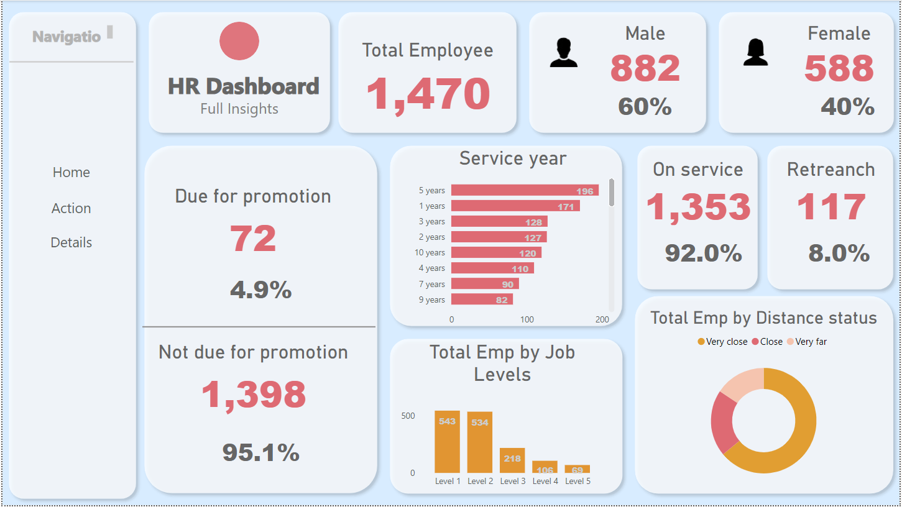
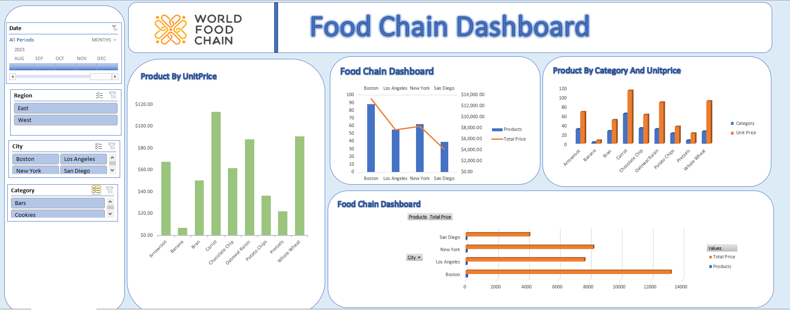
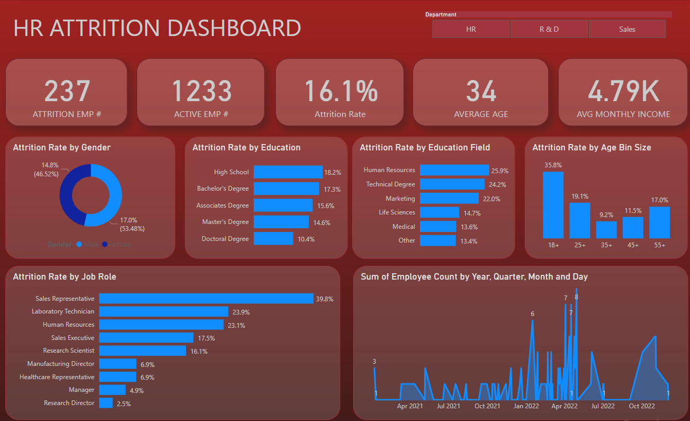
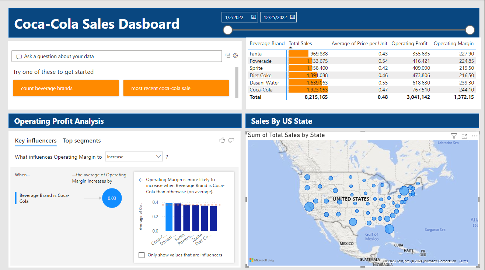
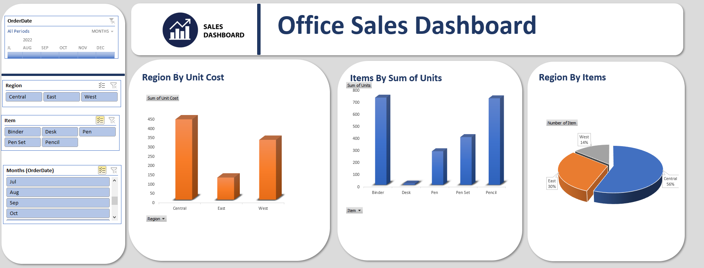

# Ayobami Aluko Portfolio

[Project 1: HR ANALYTICS_DASHBOARD](https://github.com/israel2rise/Ayobami_Data)

**Project Summary**

The HR Dashboard aims to provide a comprehensive view of the organization's workforce, focusing on key demographic indicators and promotion eligibility. The dashboard is designed to enable stakeholders to make informed decisions related to workforce management, gender diversity, and employee career progression.

Key Metrics:

Total Employee Distribution:

The dashboard presents an overview of the total employee count, providing insights into the size and composition of the workforce.
Gender Distribution:

The gender breakdown is highlighted with a clear visualization of the male and female distribution, promoting transparency and diversity awareness.
Employee Promotion Eligibility:

The dashboard categorizes employees into two groups based on their eligibility for promotion:
Due for Promotion: Employees who meet the criteria for promotion, considering performance and tenure.
Not Due for Promotion: Employees who are not currently eligible for promotion.
Tenure-Based Analysis:

The project incorporates a detailed analysis of employees with over 10 years of employment. This includes:
The number of employees with 10 or more years of service.
Specific insights into this long-tenured group's demographics and promotion eligibility.

Conclusion:
The HR Dashboard Power BI project delivers a powerful tool for HR professionals and organizational leaders to monitor and strategize workforce management effectively. By presenting a visually compelling and interactive overview of employee demographics, promotion eligibility, and long-term employment trends, the dashboard empowers stakeholders with the insights needed to make informed decisions that contribute to a balanced, diverse, and thriving workforce.

[Project 2: Food Chain Sales](https://github.com/israel2rise/Ayobami_Data)

**Project summary**

The Food Chain Sales Dashboard is designed to provide a comprehensive analysis of sales data across various dimensions, with a focus on product unit prices, product categories, and total prices. The project utilizes different methods to dissect and visualize sales information, enabling stakeholders to gain insights into product performance and regional variations within the East and West regions of key cities - Boston, Los Angeles, New York, and San Diego.

[Project 3: Hattrition_Dashboard](https://github.com/israel2rise/Ayobami_Data)

**Project Summary**

An HR attrition dashboard is a visual representation of key metrics related to employee turnover within an organization. The dashboard includes various components to provide a comprehensive view of attrition trends.
Here's a summary of the main elements:

Attrition Employee Count:

Displays the total number of employees who have left the organization during a specific time period.
Active Employee Count:

Shows the total number of employees currently working in the organization.
Attrition Rate by Gender:

Breaks down the attrition rate based on gender, providing insights into whether there are gender-specific trends in employee turnover.
Attrition Rate by Education:

Analyzes the attrition rate based on employees' educational qualifications, helping identify any correlation between education levels and turnover.
Attrition Rate by Age Bin Size:

Categorizes employees into age groups (bins) and calculates the attrition rate for each group. This helps identify if certain age demographics are more prone to leaving the organization.

By visualizing these metrics on a dashboard, HR professionals and organizational leaders can quickly grasp the overall attrition trends, identify patterns, and make informed decisions to address retention challenges. The dashboard serves as a valuable tool for strategic workforce planning and implementing targeted interventions to reduce attrition.

[Project 4: Coca-Cola](https://github.com/israel2rise/Ayobami_Data)

**Project Summary**

The Coca-Cola Sales Dashboard provides a comprehensive overview of key performance metrics for various beverage brands, including Fanta, Powerade, Sprite, Diet Coke, and Dasani water. The dashboard features a table that displays critical information such as total sales, average price per unit, operating profit, and operating margin for each brand. This allows stakeholders to quickly assess the performance of individual products and make informed business decisions.

Additionally, the dashboard incorporates a user-friendly map that visually represents the sum of sales across different USA states. This geographical breakdown enables users to identify regional trends, target areas for improvement, and optimize marketing strategies based on location-specific data.

To enhance user interaction and facilitate inquiries, search tools have been seamlessly integrated into the dashboard. Clients can easily access specific information or ask questions about sales performance, pricing, or any other relevant metrics. This interactive feature promotes real-time engagement and empowers users to extract valuable insights tailored to their specific needs. Overall, the Coca-Cola Sales Dashboard provides a dynamic and intuitive platform for monitoring and analyzing key business metrics in the beverage industry.

[Project 5: office_sales_Dashboard](https://github.com/israel2rise/Ayobami_Data)

**Project Summary**

The office sales dashboard provides a comprehensive analysis of sales performance, focusing on key metrics categorized by region, cost, and items. The primary components of the dashboard include:

Region-wise Cost Analysis:

The dashboard features a visual representation of sales costs across different regions (Central, East, West) of the USA.
Users can quickly assess and compare the cost distribution in each region, gaining insights into regional spending patterns.
Items by Sum of Units:

A detailed breakdown of sales units for specific items, including blinder, desk, pen, pen set, and pencil.
Users can easily identify the highest-selling items based on the sum of units sold, facilitating inventory management and strategic decision-making.
Region-wise Items Analysis:

This section provides a comparative analysis of item sales across the Central, East, and West regions.
Users can explore regional preferences and tailor marketing or stocking strategies based on the popularity of specific items in each region.
Interactive Slicer:

The dashboard includes an interactive slicer tool that allows users to dynamically filter data based on selected items (blinder, desk, pen, pen set, pencil) or regions (Central, East, West).
This feature enhances user flexibility, enabling them to focus on specific aspects of the sales data and derive more targeted insights.
Overall, the office sales dashboard serves as a powerful tool for sales professionals and decision-makers to assess and optimize sales strategies, identify trends, and make informed decisions based on a granular understanding of regional and item-specific performance.

